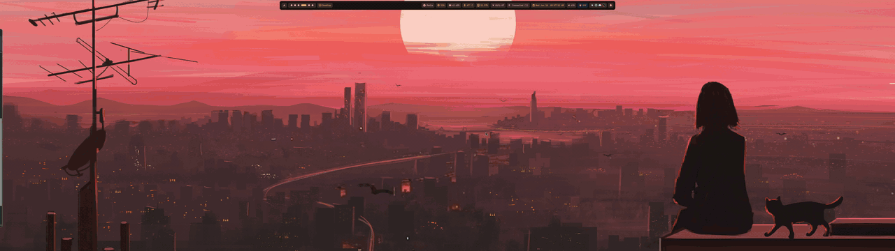

# dotfiles 

a collection of my dotfiles for my arch setup, below is a demo of the desktop running these dotfiles:

## Rebuilding the desktop

Arch Linux, Hyprland (`~/.config/hypr/hyprland.lua`) and DankMaterialShell (DMS) as the bar and shell.

1. **Packages**: `pkglist/native.txt` and `pkglist/aur.txt` are the explicitly installed packages (`pacman -Qqen` / `pacman -Qqem`).
   `sudo pacman -S --needed - < pkglist/native.txt` then `yay -S --needed - < pkglist/aur.txt`.
2. **User services**: `systemctl --user enable dms.service cliphist.service ssh-agent.service theme-apply.path theme-sync-dconf.path theme-sync.timer hyprsunset-auto.timer hyprpolkitagent.service`.
   The full enabled set (including project daemons such as `aurisd`, `os3d`, `hermes-gateway` and `dsearch`, whose units
   live in their own repos) is in `system/services-user.txt`; system units are in `system/services-system.txt`.
3. **DMS**: settings live in `~/.config/DankMaterialShell/settings.json` and `plugin_settings.json`. `dms.service` runs through
   `~/.local/bin/dms-run-patched`, which uses a patched copy of the DMS shell built by `~/.local/bin/dms-shell-patch`
   (wider launcher centred between the bar and the screen edge, and a lock-screen crossfade: Super + Alt + L fades the lock
   screen in over the desktop and back out on unlock; `LOCK_FADE_IN`/`LOCK_FADE_OUT` set the durations, `LOCK_FADE=0` disables it).
   The patch rebuilds itself after a DMS upgrade.
4. **DMS plugins**: `~/.config/DankMaterialShell/plugins/` holds symlinks to clones of
   [z89/auris](https://github.com/z89/auris) (AirPods) and [z89/ember](https://github.com/z89/ember) (night light).
   The `persona` avatar plugin lives in this repo at `~/.config/DankMaterialShell/plugins/persona`; `avatar-make` builds its picture.
5. **Colours**: DMS runs matugen on wallpaper change. User templates are in `~/.config/matugen/`; `theme-apply.path` fires
   `~/.local/bin/theme-apply` to reload kitty, GTK, Spotify, Notion, VS Code and Hyprland borders. `theme-switch` picks a wallpaper.
6. **Fonts**: Inter (UI) and JetBrainsMono Nerd Font (mono). `~/.config/fontconfig/fonts.conf` sets the fallbacks and
   `~/.config/gtk-{3,4}.0/settings.ini` the GTK fallback. On Wayland GTK reads dconf, so load the tracked keyfile once:
   `dconf load /org/gnome/desktop/interface/ < ~/.config/gsettings/interface.ini` (fonts, cursor and dark scheme;
   theme and icon names are left to `theme-apply`).
7. **Claude Desktop on the current workspace**: `hyprland.lua` has no workspace rule for Claude, so it opens where you are.
   `~/.local/share/applications/com.anthropic.Claude.desktop` overrides the package entry and runs
   `~/.local/bin/claude-focus-or-launch`, which focuses the existing Claude window (Hyprland follows it to its workspace) or
   starts Claude if none is open. Super + D goes through this automatically. Revert by deleting those two files and
   restoring the `claude-workspace` rule noted in `hyprland.lua`.

8. **System files outside `$HOME`**: `system/` mirrors the hand-edited files a rebuild needs, kept current by
   `~/.local/bin/dotfiles-sync` (also regenerates `pkglist/` and the service lists; run it before committing).
   `sudo dotfiles-sync --apply` copies them back and prints the follow-up commands:
   - `etc/default/grub`: GRUB with LVM root (`root=/dev/archvg/root`), `quiet splash preempt=full`, 1 s menu, 5120x1440 gfxmode.
   - `etc/mkinitcpio.conf`: systemd initrd, `plymouth sd-encrypt lvm2` hooks, `usbhid xhci_hcd` modules for the FIDO2 key.
     The custom `fido2-smart` and `windows-escape` hooks are in `~/.local/share/initcpio/install/` and are installed, together
     with `/etc/crypttab.initramfs` (not tracked: it carries the LUKS UUID), by `sudo ~/.local/bin/luks-boot-setup`.
   - `etc/plymouth/plymouthd.conf`: theme `dank-unlock`, generated from the palette by `~/.local/bin/plymouth-dank-theme`.
   - `etc/sysctl.d/90-split-lock.conf` plus whatever `~/.local/bin/system-tune` applies.
   - `etc/systemd/system/mirror-refresh.{service,timer}` and `usr/local/bin/mirror-refresh`: weekly reflector run
     (AU/NZ https mirrors behind the fastly anycast mirror). `/etc/pacman.d/mirrorlist` itself is generated.
9. **Login**: greetd + dms-greeter, configured by `~/.local/bin/greeter-setup`. Pick the plain "Hyprland" session, not
   "Hyprland (uwsm-managed)" (uwsm is not installed); the greeter remembers the choice in
   `/var/cache/dms-greeter/.local/state/memory.json`.
10. **Wallpapers**: `~/Pictures/wallpapers/` is what `theme-switch` cycles. Only `wallpaper.png` is tracked; the other
    images are third-party 5120x1440 art and are not committed.

Generated files are deliberately untracked and are recreated on first start: `~/.config/hypr/dms/`, `~/.config/hypr/colors.*`,
kitty `dank-tabs.conf` / `matugen-theme*.conf`, GTK `dank-colors.css` / `palette-colors.css`, and DMS `firefox.css`.
